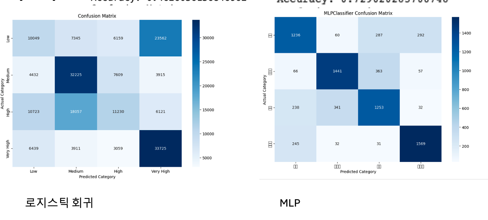

# 차량 가격 예측 프로젝트
https://www.kaggle.com/datasets/austinreese/craigslist-carstrucks-data
## 소개




이 프로젝트는 차량 데이터를 분석하고 차량 가격을 예측하기 위한 모델을 구축하는 것을 목표로 합니다. 릿지 회귀, 라쏘 회귀, 랜덤 포레스트 회귀, 그래디언트 부스팅 회귀, 서포트 벡터 회귀, XGBoost 회귀 및 MLP 회귀를 포함한 다양한 머신러닝 모델을 사용했습니다.

## 데이터 전처리

### 초기 데이터 로드 및 정리

- CSV 파일에서 데이터셋을 로드했습니다.
- 불필요한 열 제거: `url`, `region_url`, `image_url`, `VIN`, `county`, `lat`, `long`.
- 결측치 비율을 계산하고 50% 이상의 결측치를 가진 열을 제거했습니다.

### 이상치 제거

- 가격이 100달러 이하 또는 500,000달러를 초과하는 데이터 제거.
- 주행거리가 100km 이하 또는 1,000,000km를 초과하는 데이터 제거.
- 1970년 이전 또는 2021년 이후의 데이터 제거.

### 가격 범주 생성

- 가격 범주를 생성하고 결측치를 제거했습니다.
    - 저가: 101 ~ 7,500 달러
    - 중간가: 7,501 ~ 15,500 달러
    - 고가: 15,501 ~ 27,777 달러
    - 최고가: 27,778 ~ 470,000 달러

## 탐색적 데이터 분석 (EDA)

### 요약 통계

- 데이터의 기초 통계량을 출력하여 전반적인 분포를 확인했습니다.
- 범주형 변수의 도수 분포를 확인했습니다.

### 연도별 평균 가격 분석

- 1980년 이후의 연도별 평균 가격을 계산하고 시각화했습니다.
- 막대 그래프와 라인 그래프로 연도별 평균 가격의 변화를 시각화했습니다.

### 첨도와 왜도

- 가격의 첨도와 왜도를 계산하여 이상치 제거 전후의 분포를 비교했습니다.

## 모델링

### 데이터 전처리 및 분할

- 수치형 변수와 범주형 변수를 처리하기 위한 파이프라인을 구축했습니다.
- 데이터를 훈련 세트와 테스트 세트로 분할했습니다.

### 모델 학습 및 평가

여러 모델을 학습시키고 성능을 평가했습니다:

#### Ridge Regression
- R²: 0.2455
- MSE: 143949652.68

#### Lasso Regression
- R²: 0.5028
- MSE: 94872036.66

#### Random Forest Regressor
- R²: 0.5962
- MSE: 77042163.39

#### Gradient Boosting Regressor
- R²: 0.6027
- MSE: 75830247.21

#### Support Vector Regressor
- R²: 0.2386
- MSE: 145342568.94

#### XGBoost Regressor
- R²: 0.6067
- MSE: 75048764.11

#### MLP Regressor
- R²: 0.5732
- MSE: 81023245.52

### 결과 시각화

모델별 R² 점수와 MSE 값을 시각화하여 비교했습니다.

#### R² 점수 시각화
```python
import matplotlib.pyplot as plt

models = ['Ridge Regression', 'Lasso Regression', 'Random Forest Regressor', 'Gradient Boosting', 'XGBoost', 'SVM', 'MLP']
r2_scores = [0.2455, 0.5028, 0.5962, 0.6027, 0.6067, 0.2386, 0.5732]
mse_values = [143949652.68, 94872036.66, 77042163.39, 75830247.21, 75048764.11, 145342568.94, 81023245.52]

plt.figure(figsize=(16, 6))

plt.subplot(1, 2, 1)
plt.bar(models, r2_scores, color=['blue', 'green', 'red', 'purple', 'orange', 'cyan', 'magenta'])
plt.title('R² Scores by Model')
plt.xlabel('Model')
plt.ylabel('R² Score')

plt.subplot(1, 2, 2)
plt.bar(models, mse_values, color=['blue', 'green', 'red', 'purple', 'orange', 'cyan', 'magenta'])
plt.title('MSE Values by Model')
plt.xlabel('Model')
plt.ylabel('MSE')

plt.tight_layout()
plt.show()

## 모델 비교 및 평가

### 모델별 R² 점수 및 MSE 값

다양한 모델을 비교한 결과는 다음과 같습니다:

| 모델                      | R² 점수  | MSE 값        |
|---------------------------|----------|---------------|
| Ridge Regression          | 0.2455   | 143,949,652.68|
| Lasso Regression          | 0.5028   | 94,872,036.66 |
| Random Forest Regressor   | 0.5962   | 77,042,163.39 |
| Gradient Boosting         | 0.6027   | 75,830,247.21 |
| XGBoost                   | 0.6067   | 75,048,764.11 |
| Support Vector Regressor  | 0.2386   | 145,342,568.94|
| MLP Regressor             | 0.5732   | 81,023,245.52 |

### 시각화

모델별 R² 점수 및 MSE 값을 바차트로 시각화하여 비교했습니다.

```python
import matplotlib.pyplot as plt

models = ['Ridge Regression', 'Lasso Regression', 'Random Forest Regressor', 'Gradient Boosting', 'XGBoost', 'SVM', 'MLP']
r2_scores = [0.2455, 0.5028, 0.5962, 0.6027, 0.6067, 0.2386, 0.5732]
mse_values = [143949652.68, 94872036.66, 77042163.39, 75830247.21, 75048764.11, 145342568.94, 81023245.52]

plt.figure(figsize=(16, 6))

plt.subplot(1, 2, 1)
plt.bar(models, r2_scores, color=['blue', 'green', 'red', 'purple', 'orange', 'cyan', 'magenta'])
plt.title('R² Scores by Model')
plt.xlabel('Model')
plt.ylabel('R² Score')

plt.subplot(1, 2, 2)
plt.bar(models, mse_values, color=['blue', 'green', 'red', 'purple', 'orange', 'cyan', 'magenta'])
plt.title('MSE Values by Model')
plt.xlabel('Model')
plt.ylabel('MSE')

plt.tight_layout()
plt.show()


결론
다양한 모델을 테스트한 결과, XGBoost Regressor가 가장 높은 R² 점수(0.6067)와 가장 낮은 MSE(75048764.11)를 기록하며 가장 우수한 성능을 보였습니다. 이 결과를 바탕으로 차량 가격 예측에 XGBoost Regressor를 사용하는 것이 적합함을 알 수 있습니다.